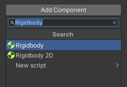

A Rigidbody component can be used to add a gravity effect to a GameObject.

Select the GameObject. In the Inspector window, choose ‘Add Component’. 

**Tip:** Enter the text ‘Rigidbody’ to search for the Rigidbody component. 

Select the ‘Rigidbody’ component to add it to your GameObject.

